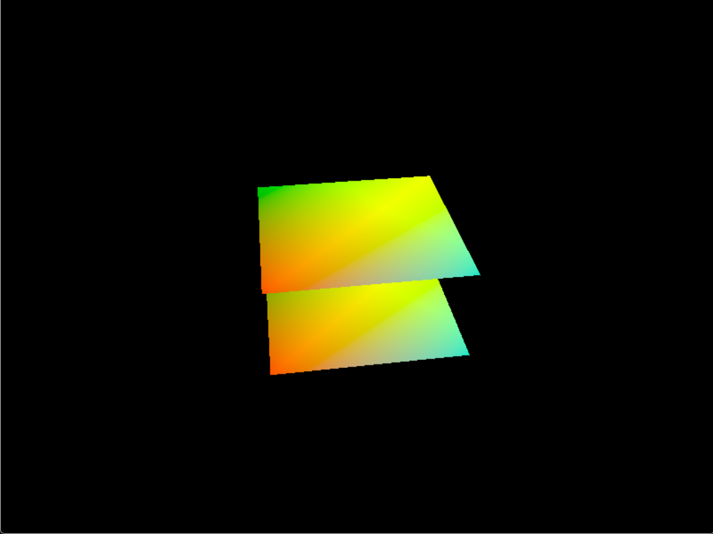
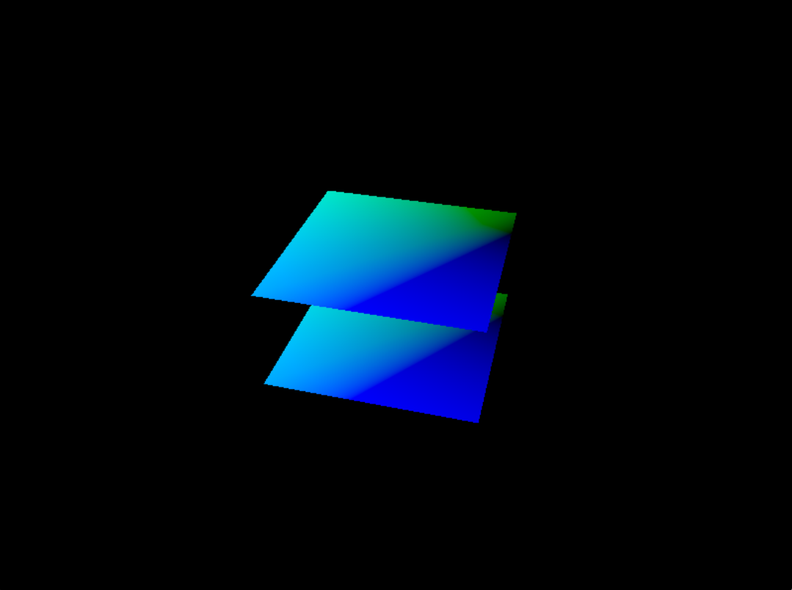

# Vulkan Rendering Engine
[![Static Badge][changelog-badge]][changelog]
[![Static Badge][license-badge]][license]

A 3D Vulkan rendering engine that can render two rotating squares.
## Table of Contents
- [Installation](#installation)
  - [Using CMake](#using-cmake)
- [Running the Program](#running-the-program)
- [Testing the Program](#testing-the-program)
- [Gallery](#gallery)
- [Known Issues](#known-issues)
## Installation
The following libraries are required to run the program:
- [OpenGL Mathematics](https://github.com/g-truc/glm)
- [Quill](https://github.com/odygrd/quill)
- [SDL](https://www.libsdl.org/)
- [Volk](https://github.com/zeux/volk)
- [Vulkan](https://www.vulkan.org/)

### Using CMake
1. Download and extract the .zip file
2. Open a terminal in the extracted folder directory
3. Run `cmake CMakeLists.txt`.
4. Run `make`.
## Running the Program
To run the program, simply go to the repository and run `./VoxelEngine`.
## Testing the Program
There are currently no tests written for the program.
## Gallery

## Known Issues
Low priority:
- framerate randomly varies between program runs (e.g. 5-6k FPS one time, 7-8k the next)

[changelog]: ./CHANGELOG.md
[changelog-badge]: https://img.shields.io/badge/version-v0.0.0-blue
[license]: ./LICENSE
[license-badge]: https://img.shields.io/badge/license-MIT-blue
